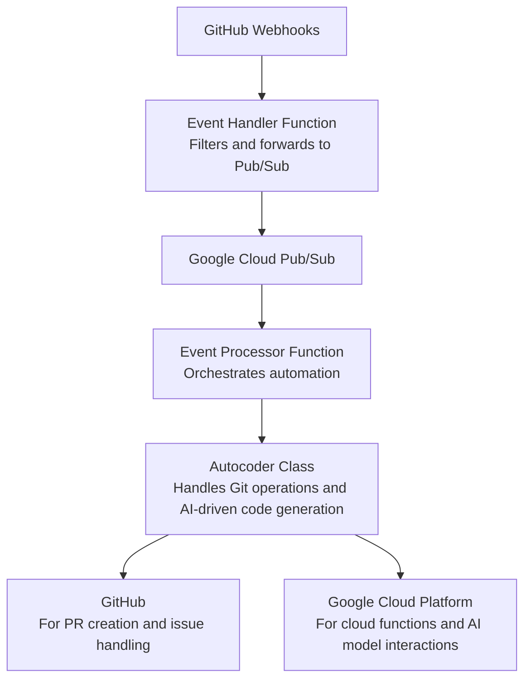

# genai-issue-actor



This project delves into the potential of Generative AI to automate code changes based on GitHub issue submissions. It illustrates a modern approach to software development:

1. Users submit issues in the GitHub repository, detailing requested changes in plain language.
2. A webhook, set up for new issues, notifies a Google Cloud-hosted Cloud Function, which then clones the repository.
3. The Cloud Function creates a new branch, where generative AI interprets and implements the proposed changes.
4. Changes are pushed to the repository, and a pull request is opened, referencing the original issue.

## Deployment

Fork this project to explore further. To deploy on GCP:

1. Generate a GitHub personal access token with issue write permissions.
2. Generate an RSA deploy key with write access for your fork.
3. Obtain an API KEY for the Gemini API.
4. Run `terraform apply` in the infrastructure folder.
5. Add secret versions to the Secret Manager.
6. Set your GitHub webhook to notify this function on new issues.


### Introduction: A New Chapter in Automation

In the rapidly evolving landscape of cloud engineering, our journey is transitioning from human-driven scripts to complex, AI-driven workflows. Leveraging the synergy between GitHub, Google Cloud Platform (GCP), and its latest Model in artificial intelligence, we have embarked on a path that seeks to automate and refine the process of code creation. This post explores the evolution from an initial project conceived by Evan Seabrok to a more extensive, two-pronged approach that tries to leverage modern development practices.

### The Genesis: From Single Script to Dual Functionality

The inception of this project saw a straightforward "one to one" execution model. A singular Python script performed the magic, directly handling GitHub issues and engaging with GCP functions for processing. This version was characterized by its direct approach, utilizing environment variables, the `functions_framework` for Cloud Functions, and `pygit2` for git operations, encapsulated within a bespoke Autocoder class.

this is the main Cloud Function that will be triggered by GitHub webhooks.

```python
# main.py
import os
from github import Github
import pygit2
import base64

GITHUB_TOKEN = os.environ.get('GITHUB_TOKEN')
REPO_NAME = os.environ.get('REPO_NAME')

def handle_github_event(event):    
    #Autocoder handles all git operations
    autocoder = Autocoder()
    autocoder.handle_issue(event)
    return 'Success...
```

This is the Bespoke autocode class:

```python
# Advanced Version: Modular and AI-driven approach for automated code changes
import pygit2
import github
import vertexai
from vertexai.language_models import TextGenerationModel

class Autocoder:
    def __init__(self, gcp_project, gcp_location, git_private_key, git_public_key, git_pat):
        # Initialize GitHub and Vertex AI, setting up for git operations and AI-driven code generation
        self._github = github.Github(git_pat)
        vertexai.init(project=gcp_project, location=gcp_location)
        self._llm = TextGenerationModel.from_pretrained('text-bison@002')
    
    def clone_repository(self, repo_link):
        # Clone repository using pygit2 with SSH credentials
        pass
    
    def create_branch(self, branch_name=None, desired_change=None):
        # Generate branch name and create branch based on AI model suggestions
        pass
    
    def apply_code_changes(self, path_to_code, desired_change):
        # AI-driven code modification based on natural language descriptions
        pass
    
    def update_unit_tests(self, path_to_tests, updated_code):
        # Automatically update unit tests to match the new code logic
        pass
    
    def create_commit(self, replacement_code, commit_message=None):
        # Create and push a commit with AI-generated message if not provided
        pass
    
    def push_remote(self):
        # Push changes to the remote repository
        pass
    
    def create_pr(self, repo_id, issue_number, commit_message):
        # Create a pull request on GitHub, linking it to the issue
        pass

    @staticmethod
    def cleanup_local_dir():
        # Clean up local repository directory after operations
        pass
```

### A new architecture


#### The Event Handler Function
Transitioning to a more scalable and modular architecture, the `event_handler` function emerged as a gatekeeper, processing GitHub webhook events and forwarding them to a Google Cloud Pub/Sub topic. This function is our initial layer of abstraction, filtering and validating data for subsequent processing.

#### The Maestro: Event Processor Function
Following suit, the `event_processor` function orchestrates the nuanced process of automation, acting upon messages from the Pub/Sub topic. This function deciphers event data, setting the stage for complex operations like repository cloning, branch creation, and pull request initiation.

The Autocode Class is now an auxliary to the `event_processor` function.

Let's take a look at the enhancements in code

### Enhancements in Security and Modularity

#### From Base64 to HMAC Verification
The new version introduces HMAC verification for GitHub webhooks, a leap in security, ensuring the integrity and authenticity of incoming requests and protecting the owner of the repository from malicious actors and undisired charges.

```python
# New Version: Enhanced security with HMAC
import hashlib
import hmac
import os

SECRET = os.environ.get('WEBHOOK_SECRET')

def verify_signature(header_signature, body):
    # HMAC verification
    mac = hmac.new(SECRET, msg=body, digestmod=hashlib.sha256)
    return hmac.compare_digest(mac.hexdigest(), header_signature)
```
the signature in runtime comes from a Secret Manager secret in GCP, and it's made available to the function as an environment variable.
a signature that does not match our will not be processed.


#### Modular Design: Separating Concerns
The new architecture champions modularity, splitting the application into focused modules (`handle_issue` and `event_processor`). This separation of concerns not only clarifies the codebase but also enhances maintainability and scalability.

More importantly it fixes the problem of timeouts. the Gemini Genai processing is very powerfull bu can be time consuming, this delay created the problem of timeouts on the github webhook calls.

Following this new approach the webhook is now easily 
- **filtered**: ignored if signature is invalid, or if not an issue event, or if not an open issue, or if the issue does not have a body, or if the body is empty, or if the issue is already assigned.
- **preprocessed**: translate the issue body to a json object 
```json
{
  "change_request": {
    "description": "Description of the change",
    "affected_files": ["main.py"]
  }
}
```
- **delegated**: the webhook is now delegated to the `event_processor` function via pub/sub
- and quickly **acked** as "in progress".


```python
# New Version: Modular approach
# Abstraction and improved code organization
from utility import get_env_var
from event_processor import process_event

def handle_issue(issue_event):
    filter: is assigned? is opened? has a body?
    preprocess(event) # translate the issue body to a json object
    process_event(issue_event) # send to pubsub
    return 'Success...
```

### The Dance of Advanced AI and Machine Learning

The new version of the code introduces several significant changes and improvements over the old version. Here's a detailed comparison of the key differences:

1. **Removal of `vertexai` Dependency and Introduction of `langchain_google_genai`**:
```python
# Old Code
import vertexai
from vertexai.language_models import TextGenerationModel

# New Code
from langchain_google_genai import ChatGoogleGenerativeAI
```
The new code removes the dependency on `vertexai` and instead introduces `langchain_google_genai` for interacting with Google's Generative AI models. This change likely reflects a shift towards using a more specific or updated library for AI-driven operations, potentially offering improved functionality or better integration with Google's AI services.

2. **Introduction of Pydantic Models for Validation**:
```python
from langchain.prompts import PromptTemplate
from langchain.output_parsers import PydanticOutputParser
from langchain_core.pydantic_v1 import BaseModel, Field, validator
```
The new version leverages Pydantic models (`GitBranch`, `GitFile`, `GitCommit`) for data validation and transformation. Pydantic is a data validation and settings management library which uses Python type annotations to validate data. This ensures that the data conforms to specified formats and rules before processing, enhancing the robustness and reliability of the code.

3. **Enhanced Error Handling with Specific Exceptions**:
```python
# Old Code
except:
    logger.error("Unable to fetch file contents.")
    raise

# New Code
except Exception as e:
    logger.error(f"Unable to fetch file contents: {e}")
    raise
```
The new code provides more detailed error logging by catching and logging the specific exception. This can help in diagnosing issues more effectively by giving insight into what exactly went wrong.

4. **Use of `os.path.exists` in `cleanup_local_dir` Method**:
```python
# Old Code
shutil.rmtree(REPO_DIR, True)

# New Code
if os.path.exists(REPO_DIR):
    shutil.rmtree(REPO_DIR, ignore_errors=True)
```
The new code checks if the directory exists before attempting to remove it. This prevents potential errors from attempting to delete a non-existent directory and makes the code more robust.

Let's delve deeper into the specific changes and the introduction of new classes, as well as the concept of output parsers in the context of the updated code.

### 5. Changes in `create_commit` and `create_pr` Methods for Commit Message Handling

The new code introduces a standardized way to handle and validate commit messages using the `GitCommit` Pydantic model. This model includes a validator that ensures commit messages are free from code block markers at the start or end, which is crucial for maintaining proper formatting and processing in various systems that might interpret these markers in a specific way.

Here's a closer look at the `GitCommit` class:
```python
class GitCommit(BaseModel):
    message: str = Field(description="a git commit message")

    @validator('message')
    def validate_message(cls, v):
        if v.startswith('```') or v.endswith('```'):
            raise ValueError("The commit message must not start or end with ('```')")
        return v
```

This class uses Pydantic's `BaseModel` to define a schema for commit messages, ensuring they adhere to specified constraints, thus preventing potential issues in downstream processes or tools that consume these messages.

### 6. Dynamic Branch Name Generation Using Pydantic Validator

The `GitBranch` class represents a significant enhancement in how branch names are generated and validated. By employing Pydantic validators, the class dynamically ensures that branch names comply with git best practices and the specific constraints of the repository management system in use.

```python
class GitBranch(BaseModel):
    name: str = Field(description="valid name for a git branch")

    @validator('name')
    def restrictions(cls, name):
        # Logic to replace forbidden characters and patterns
        return name
```

This approach allows for the automatic correction of branch names, ensuring they do not contain forbidden characters or patterns, thus aligning with git and repository management conventions.

### 7. Improved File and Commit Message Validation

The introduction of `GitFile` and `GitCommit` classes with validators marks a leap towards ensuring that both file contents and commit messages are not just valid but also conform to the expected standards before they are processed or committed to the repository.

```python
class GitFile(BaseModel):
    file: str = Field(description="valid file contents")

    @validator('file')
    def validate_file_language(cls, v):
        # Logic to ensure file contents meet specific language constraints
        return v
```

These validators play a critical role in automating the validation process, reducing manual review overhead, and enhancing the overall code quality and consistency across commits.

### Use of Output Parsers

The concept of output parsers, as exemplified by the `PydanticOutputParser`, is instrumental in the new code structure. An output parser takes the output from a function or operation—like AI-generated text—and parses it into a structured format or object, in this case, a Pydantic model. This process ensures that the output not only meets the structural and content requirements defined by the model but also is easily manipulable and verifiable by subsequent code logic.

```python
parser = PydanticOutputParser(pydantic_object=GitBranch)
```

By employing output parsers in conjunction with prompt templates, the code effectively bridges the gap between unstructured AI outputs and the structured requirements of the application, ensuring data integrity, consistency, and adherence to predefined schemas.

These improvements and the adoption of modern software engineering practices, such as using Pydantic for data validation and structured AI output parsing, significantly enhance the code's maintainability, robustness, and error resilience.


### Use of `PromptTemplate` in the New Code

The introduction of `PromptTemplate` is another key change in the new code, enhancing how prompts are constructed and managed when interacting with AI models. This class allows for dynamic prompt generation based on a template and input variables, ensuring that prompts are both flexible and consistent across different operations.

```python
prompt = PromptTemplate(
    template="Create a branch name for this change:\n{desired_change}\nuse this guidelines:\n{contributing}\nformat:\n{format_instructions}",
    input_variables=["desired_change", "contributing"],
    partial_variables={"format_instructions": parser.get_format_instructions()}
)
```

**Role and Benefits of `PromptTemplate`:**

- **Dynamic Prompt Construction:** It enables dynamic construction of prompts by allowing placeholders within a template string to be replaced with actual values at runtime. This is particularly useful for generating context-specific prompts for AI models without hardcoding the prompt for each scenario.
  
- **Consistency and Scalability:** By using templates, the code ensures consistency in how prompts are formulated. This approach makes it easier to update or modify prompts without touching the core logic that handles the interaction with the AI model.
  
- **Customization and Flexibility:** `PromptTemplate` supports customization through `input_variables` and `partial_variables`, allowing developers to tailor prompts to specific needs while maintaining a clear separation between the template structure and the dynamic content.

- **Integration with Pydantic Models:** The use of `PromptTemplate` in conjunction with Pydantic validators and output parsers (e.g., `PydanticOutputParser`) showcases a pattern where structured data validation and transformation are applied to AI-generated outputs. This integration ensures that the outputs conform to predefined models, enhancing data integrity and application reliability.

Here's an expanded view of how `PromptTemplate` integrates with the rest of the system:

```python
chain = prompt | self._llm | parser
response = chain.invoke({
    "desired_change": desired_change, 
    "contributing": contributing
})
```

In this workflow, a `PromptTemplate` is used to generate a prompt that is then passed to an AI model (`self._llm`). The output from the model is subsequently parsed by a `PydanticOutputParser`, ensuring the final output adheres to the structure and constraints defined by a Pydantic model (e.g., `GitBranch`).

This pattern not only simplifies interactions with complex AI models but also ensures the outputs are immediately usable within the application, adhering to best practices for software design and data management.


### update_unit_tests
The `update_unit_tests` method's absence in the new `Autocoder` class reflects a strategic decision in the design of the autocode modification process, due to several key considerations:

1. **AI Model Integration**: The new version of the `Autocoder` class leverages advanced AI models for code generation and modification. These models, such as Google's Generative AI accessed via `ChatGoogleGenerativeAI`, can potentially update both code and corresponding unit tests within a single operation. If the AI is trained to consider the implications of code changes on unit tests, it might adjust the tests as part of the code update process, reducing the need for a separate method to update unit tests.

2. **Streamlined Process**: By incorporating the validation and update of unit tests directly into the `apply_code_changes` method or ensuring that the AI model handles these considerations automatically, the workflow becomes more streamlined. This approach minimizes the steps required to apply and commit changes, simplifying the overall process.

### Conclusion: Redefining the Art of Cloud Engineering

This evolution from a singular, direct script to a sophisticated, dual-function system encapsulates the transformative power of AI and cloud technologies in development practices. As we forge ahead, our journey from the old version to the new, augmented by AI, security enhancements, and a modular design, stands as a testament to the ongoing redefinition of cloud engineering. With each step, we remain committed to exploring the vast possibilities offered by GitHub and GCP integration, ensuring our automated workflows are not only effective but also secure, scalable, and forward-looking.


Original concept: Evan Seabrook
