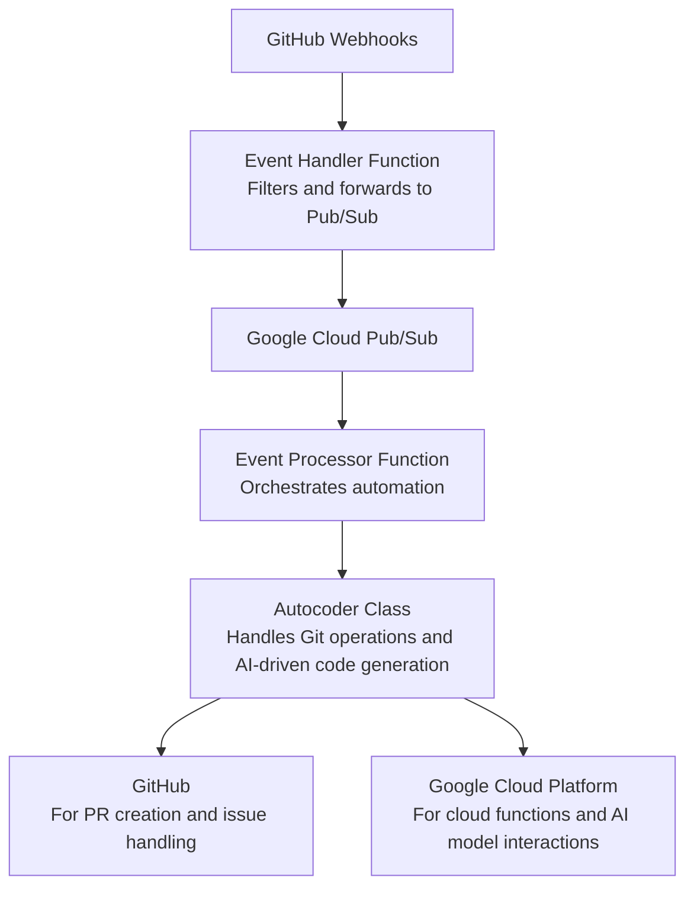

# genai-issue-actor

Original Author: Evan Seabrook

This project delves into the potential of Generative AI to automate code changes based on GitHub issue submissions. It illustrates a modern approach to software development:

1. Users submit issues in the GitHub repository, detailing requested changes in plain language.
2. A webhook, set up for new issues, notifies a Google Cloud-hosted Cloud Function, which then clones the repository.
3. The Cloud Function creates a new branch, where generative AI interprets and implements the proposed changes.
4. Changes are pushed to the repository, and a pull request is opened, referencing the original issue.

## Deployment

Fork this project to explore further. To deploy on GCP:

1. Generate a GitHub personal access token with issue write permissions.
2. Generate an RSA deploy key with write access for your fork.
3. Obtain an API KEY for the Gemini API.
4. Run `terraform apply` in the infrastructure folder.
5. Add secret versions to the Secret Manager.
6. Set your GitHub webhook to notify this function on new issues.

## New Features and Enhancements

### Enhanced AI Integration

The updated version integrates more advanced Generative AI models for nuanced code adaptation. This ensures more accurate and context-aware changes, directly from issue descriptions.

### Security Improvements

- **HMAC Verification for Webhooks**: Ensures integrity and authenticity of incoming requests, safeguarding against unauthorized alterations.
- **Secret Management**: API keys and tokens are securely managed via GCP's Secret Manager, enhancing security and simplifying configuration.

### Infrastructure as Code

- **Terraform Deployment**: Simplified cloud resource management allows for easy setup and deployment of necessary infrastructure with minimal manual intervention.

### Modular Code Structure

- **Improved Modularity**: The application's architecture has been refactored for better separation of concerns, enhancing readability, maintainability, and scalability.
- **Dynamic Branch Creation**: AI-driven logic for branch naming and creation facilitates a more streamlined development workflow.

### Continuous Integration and Deployment

- **Automated Testing and Deployment**: Integration with CI/CD pipelines ensures that changes are automatically tested and deployed, maintaining code quality and efficiency.

### Conclusion

The evolution of the `genai-issue-actor` project showcases the transformative potential of integrating Generative AI into development workflows. By automating the interpretation and implementation of issue-based code changes, it sets a new standard for efficiency and innovation in software development.
