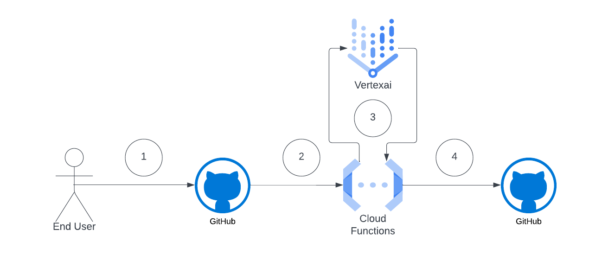

# genai-issue-actor
Author: Evan Seabrook

This project was created to explore how Generative AI could help facilitate code changes based on issues created in a repository. To explore this, I designed a workflow following roughly how code is developed today in a simple project:

1. A user submits a new issue within the GitHub repository outlining in plain language what change they would like to see. 

2. A webhook configured to fire for new issues posts the details to a Cloud Function hosted within my Google Cloud project, which clones the repository. 

3. Once the repo has been cloned, a new branch is created and the code is adapted using generative AI viaVertex AI to interpret and make the requested changes. 

4. The Cloud Function pushes the changes to the repository and opens a pull request referencing the original issue. 

**IMPORTANT:** To prevent an influx of personal cloud costs, I have disabled the webhook. I encourage folks that are interested in this project to fork this repository and experiment with it yourselves.

## Project Structure
The project is split into several key directories/modules:
 - cloud_function
   - Houses the webhook application code that handles new issues, makes code changes in `main.py` and `tests`, and pushes them to this repository + creates a pull request.
 - tests
   - Houses the unit tests for `main.py`
 - main.py
   - Houses a simple "hello world" application for demonstration purposes.

## Deployment
If you are interested in experimenting with this project further, please fork it. To set up the Cloud Function on GCP, you will need to:
1. Generate a personal access token for your GitHub account (it will need write permissions for Issues in your fork)
2. Generate an RSA deploy key for your repository (it will need write access to your fork)
3. Set up a GCP project and upload the code in `cloud_function` as the source. You will need to populate the following environment variables based on the setup in steps 1-3:  

    **project_id**: The GCP project ID  
    **location**: The Vertex AI location to run inference against  
    **github_pat**: Your personal access token
    **PRIVATE_KEY**: Base 64 encoded private key (from your deploy key)
    **PUBLIC_KEY**: Base 64 encoded public key (from your deploy key)  

    I would recommend bumping up the Cloud Function specs to 1GB RAM / 1vCPU.

